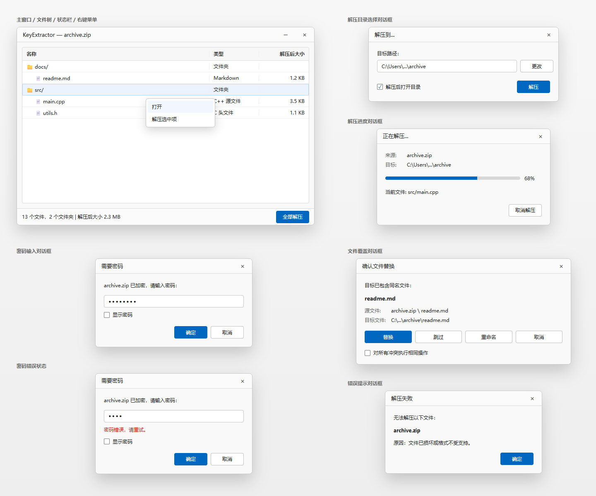

# KeyExtractor 软件设计文档

> 版本: 1.0 | 日期: 2026-06-29 | 状态: 草案

---

## 1. 项目概述

KeyExtractor 是一款面向 Windows 平台的现代化解压软件，通过 Qt6 渲染界面、7zip 内核驱动解压，最终以 MSIX 格式打包上架微软应用商店。

### 1.1 核心目标
- 支持 ZIP / RAR / 7Z / TAR 四种压缩格式的解压
- 文件关联：对四种格式注册"打开方式"，作为主要调起入口
- 右键菜单扩展：提供"用 KeyExtractor 打开"和"解压到..."两个 Shell 扩展
- 树型视图展示压缩包内文件列表
- 符合微软商店上架的全部技术与安全规范
- 支持英文与简体中文界面

### 1.2 技术栈
| 层 | 选型 | 说明 |
|---|------|------|
| 语言 | C++20 | Windows SDK 兼容性 |
| 界面 | Qt 6.x (via vcpkg) | Widgets 模块用于主窗口，Core/Gui 作为基础 |
| 解压内核 | 7zip SDK (via vcpkg) | vcpkg 提供可链接库与 SDK 头文件，封装 7zip COM 风格接口 |
| 包管理 | vcpkg (manifest mode) | 管理 Qt6、7zip 等三方依赖 |
| 构建 | CMake 3.21+ | 跨平台构建配置 |
| 打包 | MSIX (Windows Application Packaging) | 用于 Microsoft Store 上架 |
| 国际化 | Qt Linguist (`.ts` / `.qm`) | 英文 + 简体中文 |

---


## 2. 系统架构

### 2.1 整体分层

```
┌──────────────────────────────────────────────┐
│                 MSIX 安装包                    │
│  ┌────────────────────────────────────────┐   │
│  │          UI 层（Qt6 Widgets）           │   │
│  │  · MainWindow                          │   │
│  │  · FileTreeView / FileTreeModel        │   │
│  │  · ExtractPathDialog                   │   │
│  │  · ExtractionDialog                   │   │
│  │  · PasswordDialog / OverwriteDialog    │   │
│  │  · ErrorDialog                         │   │
│  ├────────────────────────────────────────┤   │
│  │          核心逻辑层（C++）              │   │
│  │  · ArchiveManager                     │   │
│  │  · ExtractionWorker（QThread）         │   │
│  │  · CommandLineParser                  │   │
│  ├────────────────────────────────────────┤   │
│  │          解压内核层                     │   │
│  │  · SevenZipEngine（封装 7zip API）     │   │
│  ├────────────────────────────────────────┤   │
│  │        系统集成层（MSIX 声明式）         │   │
│  │  · AppxManifest.xml（文件关联+右键菜单） │   │
│  │  · 部署引擎处理声明式 Shell 集成（第4章）  │   │
│  └────────────────────────────────────────┘   │
└──────────────────────────────────────────────┘
```

### 2.2 进程模型

```
KeyExtractor.exe  — 唯一进程：承载 UI + 核心逻辑 + 解压内核
```

本应用采用**单进程架构**。在 MSIX 声明式集成模型下，文件类型关联和右键
菜单均通过 `AppxManifest.xml` 声明完成，部署引擎在安装时自动向真实注册表
写入必要键值——不需要 COM Shell Extension DLL、不需要进程外服务器、不需要
后台常驻进程。

### 2.3 MSIX 声明式集成总览

```
AppxManifest.xml 声明
        │
        │  安装时
        ▼
AppX 部署引擎
        │
        ├──→ 系统注册文件类型关联与 ProgID
        ├──→ 系统注册固定 Shell verbs（打开 / 解压到...）
        └──→ 默认打开程序仍由用户选择或系统策略决定
                │
                │  运行时
                ▼
    用户双击 / 右键压缩文件
                │
                ▼
    Explorer 读取真实注册表 → 启动 KeyExtractor.exe <path>
```

**核心设计原则**：系统集成不靠程序运行时修改注册表，全靠清单声明。程序本身
不包含注册表操作代码，只需在 `main.cpp` 中解析命令行参数（文件路径 + verb）。

---
## 3. 模块设计

### 3.1 模块总览

```
src/
├── main.cpp                          # 入口，命令行参数解析；多文件时启动多个独立进程
├── app/
│   ├── Application.h/cpp             # QApplication 子类，全局初始化
│   └── CommandLineParser.h/cpp       # 解析命令行（文件路径、Shell verb）
├── ui/
│   ├── MainWindow.h/cpp              # 主窗口（标题栏、文件树、状态栏）
│   ├── FileTreeView.h/cpp            # QTreeView 封装，展示压缩包内文件
│   ├── FileTreeModel.h/cpp           # QAbstractItemModel 子类，文件树数据模型
│   ├── ExtractPathDialog.h/cpp       # 解压目录选择对话框
│   ├── ExtractionDialog.h/cpp        # 解压进度对话框
│   ├── PasswordDialog.h/cpp          # 密码输入对话框
│   ├── OverwriteDialog.h/cpp         # 文件覆盖对话框
│   ├── ErrorDialog.h/cpp             # 错误提示对话框
├── core/
│   ├── ArchiveManager.h/cpp          # 解压调度中心，协调 UI 与内核
│   ├── ArchiveItem.h/cpp             # 压缩包文件条目数据结构
│   ├── ExtractionOptions.h           # 解压选项（目标路径、覆盖策略等）
│   └── ExtractionWorker.h/cpp        # 后台解压线程
├── engine/
│   ├── SevenZipEngine.h/cpp          # 7zip SDK 接口封装
│   └── ArchiveFormat.h               # 格式枚举 (ZIP/RAR/7Z/TAR) + MIME 映射
├── shell/
│   └── ShellCommandVerb.h            # Shell verb 常量定义
└── resources/
    ├── translations/
    │   ├── keyextractor_zh_CN.ts
    │   └── keyextractor_zh_CN.qm
    ├── KeyExtractor.rc               # Windows 资源文件（图标、版本信息）
    ├── app.ico
    ├── app.manifest                  # SxS 清单
    └── qt.conf                       # Qt 运行时配置
```

### 3.2 关键模块说明

#### 3.2.1 ArchiveItem (数据模型)
```cpp
struct ArchiveItem {
    std::wstring name;      // 文件名（含后缀）
    std::wstring path;      // 压缩包内完整路径
    uint64_t    size;       // 解压后大小（bytes）
    bool        isDirectory;// 是否为目录
    // 树结构：父节点指针 + 子节点列表
};
```

#### 3.2.2 ArchiveManager
- 接收解压任务（打开查看 / 解压到指定目录）
- 调用 `SevenZipEngine` 列出文件列表、执行解压
- 管理 `ExtractionWorker` 线程，通过 Qt 信号槽与 UI 通信
- 接口：

```cpp
class ArchiveManager : public QObject {
    Q_OBJECT
public:
    void openArchive(const QString& filePath);           // 打开压缩包，列出文件树
    void extractAll(const QString& destDir);             // 全部解压
    void extractSelected(const QStringList& itemPaths,
                         const QString& destDir);        // 解压选中条目
    void extractAndOpen(const QString& itemPath);        // 单文件解压到临时目录 + 系统默认程序打开
    void cancelExtraction();
signals:
    void fileListReady(const QVector<ArchiveItem>& items);
    void extractionProgress(int percent, const QString& currentFile);
    void extractionFinished(bool success, const QString& errorMsg);
};
```

#### 3.2.3 SevenZipEngine
通过 vcpkg 链接 7zip SDK 库，提供：
- `listArchive(path)` → `QVector<ArchiveItem>`
- `extractItems(path, destDir, itemPaths)` → 进度回调
- 支持密码输入（加密压缩包）
- 内部使用 `7zTypes.h`、`IInArchive`、`IArchiveExtractCallback` 等 7zip SDK 类型与回调接口
- 以适配层隔离 7zip 的 COM 风格对象、HRESULT 错误码、UTF-16 路径转换和回调线程模型

> **vcpkg 集成说明**: 优先通过 `vcpkg.json` 声明 `7zip` port 并链接其 SDK 产物。
> P1 阶段必须验证该 port 的导出 target、库形态和头文件布局；`SevenZipEngine`
> 不应假设固定为 DLL，也不应通过调用 `7z.exe` 完成功能。


---

## 4. Windows Shell 集成设计

本章只描述 KeyExtractor 与 Windows Explorer 的集成边界：文件类型关联、右键菜单、
命令行入口和注册表策略。UI 内部的树视图右键菜单见第 5 章。

### 4.1 集成目标与边界

#### 4.1.1 目标

| 能力 | 用户可见效果 | 实现方式 |
|------|-------------|----------|
| 文件类型关联 | `.zip` / `.rar` / `.7z` / `.tar` 可在"打开方式"和默认应用设置中选择 KeyExtractor | `AppxManifest.xml` 的 `windows.fileTypeAssociation` |
| 固定右键菜单 | 压缩包右键菜单显示"用 KeyExtractor 打开"和"解压到..." | `uap2:SupportedVerbs` / `uap3:Verb` |
| 命令行调起 | Explorer 将文件路径和操作意图传给 `KeyExtractor.exe` | `Verb.Parameters` + `CommandLineParser` |

#### 4.1.2 非目标

- 不通过运行时代码写入 `HKCR`、`HKLM` 或 `UserChoice`
- 不静默接管默认打开程序；默认应用必须由用户在系统 UI 中选择
- 不实现按选中文件数量动态变化的 Explorer 右键菜单
- 不引入 COM Shell Extension、IExplorerCommand 或后台常驻进程

#### 4.1.3 基本原则

MSIX 是声明式部署模型。Shell 集成能力写入 `AppxManifest.xml`，由 Windows 部署与
Shell 组件在安装时注册，卸载时清理。程序代码只负责解析启动参数并执行对应业务逻辑。

### 4.2 清单声明结构

文件关联与固定右键菜单放在同一个 `FileTypeAssociation` 中声明，避免在文档中分散成
两套互相重复的 XML 片段。

```xml
<Extensions>
  <uap:Extension Category="windows.fileTypeAssociation">
    <uap:FileTypeAssociation Name="kext.archive">
      <uap:SupportedFileTypes>
        <uap:FileType>.zip</uap:FileType>
        <uap:FileType>.rar</uap:FileType>
        <uap:FileType>.7z</uap:FileType>
        <uap:FileType>.tar</uap:FileType>
      </uap:SupportedFileTypes>
      <uap2:SupportedVerbs>
        <uap3:Verb Id="open"
                   Parameters="&quot;%1&quot;"
                   MultiSelectModel="Player">用 KeyExtractor 打开</uap3:Verb>
        <uap3:Verb Id="extract"
                   Parameters="&quot;--extract&quot; &quot;%1&quot;"
                   MultiSelectModel="Player">解压到...</uap3:Verb>
      </uap2:SupportedVerbs>
    </uap:FileTypeAssociation>
  </uap:Extension>
</Extensions>
```

清单根元素需要声明 `uap`、`uap2`、`uap3` 命名空间，并将 `uap2`、`uap3` 加入
`IgnorableNamespaces`。实际命名空间 URI 以最终 `AppxManifest.xml` 模板和目标
Windows SDK 为准。

### 4.3 文件类型关联

#### 4.3.1 支持的扩展名

首版只声明四类压缩包扩展名：

| 扩展名 | 格式 | 首版行为 |
|--------|------|----------|
| `.zip` | ZIP | 列表、解压、密码按 7zip SDK 能力支持 |
| `.rar` | RAR | 列表、解压；RAR 加密与版本差异在 P1 验证 |
| `.7z` | 7Z | 列表、解压、密码按 7zip SDK 能力支持 |
| `.tar` | TAR | 列表、解压；压缩封装如 `.tar.gz` 不在首版关联范围 |

#### 4.3.2 默认应用策略

文件类型关联只表示 KeyExtractor 是这些扩展名的候选处理程序。安装 MSIX 后，用户应能在
"打开方式"和 Windows 默认应用设置中看到 KeyExtractor，但应用不能承诺或强制自己成为
双击默认程序。

如果产品希望用户把 KeyExtractor 设为默认解压器，采用温和提示：

1. 首次启动或首次打开压缩包时检查是否为默认处理程序
2. 若不是默认处理程序，显示一次性提示
3. 引导用户进入 Windows 默认应用设置，由用户手动选择

#### 4.3.3 打开调用链路

```
用户双击压缩包，或右键选择"用 KeyExtractor 打开"
        │
        ▼
Explorer 解析文件类型关联和 Shell verb
        │
        ▼
KeyExtractor.exe "<archive-path>"
        │
        ▼
CommandLineParser
        │
        ▼
ArchiveManager::openArchive(path)
        │
        ▼
MainWindow 显示压缩包文件树
```

### 4.4 Explorer 右键菜单

#### 4.4.1 菜单项

| 菜单项 | Verb Id | 参数模板 | 程序行为 |
|--------|---------|----------|----------|
| 用 KeyExtractor 打开 | `open` | `"%1"` | 打开压缩包并显示文件树 |
| 解压到... | `extract` | `"--extract" "%1"` | 弹出目标目录选择对话框并开始解压流程 |

`Verb` 元素文本直接作为菜单项标题。后续如果需要国际化 Explorer 菜单标题，应改为
资源字符串，而不是在代码里动态生成。

#### 4.4.2 多选行为

两个 Verb 均使用 `MultiSelectModel="Player"`。预期行为是 Explorer 将多个选中文件
作为独立参数传入同一个进程：

```powershell
KeyExtractor.exe "C:\a.zip" "C:\b.rar" "C:\c.7z"
```

应用侧必须容忍两种情况：

| 触发方式 | 预期参数 | 应用行为 |
|----------|----------|----------|
| 单选打开 | `<path>` | 打开单个主窗口 |
| 多选打开 | `<path1> <path2> ...` | 最多处理前 10 个文件，每个文件一个独立主窗口 |
| 单选解压 | `--extract <path>` | 弹出单个目标目录选择对话框 |
| 多选解压 | `--extract <path1> <path2> ...` | 弹出单个目标目录选择对话框，串行逐个解压 |

如果后续验证发现某些 Windows 版本对 `Player` 模型的多选传参不稳定，则降级为
`MultiSelectModel="Document"`，让 Explorer 为每个文件分别启动一次进程。

#### 4.4.3 不做动态菜单的原因

MSIX 标准的 `SupportedVerbs` 只能声明固定 Verb 集，无法根据选中文件数量动态显示或隐藏
菜单项。动态 Explorer 菜单通常需要额外的上下文菜单扩展机制，复杂度、测试矩阵和商店审核
风险都明显增加，当前版本不引入。

### 4.5 命令行契约

`CommandLineParser` 是 Shell 集成与应用逻辑之间的唯一入口。它需要把 Explorer 传入的参数
转换为明确的业务意图。

| 命令行 | 解析结果 | 后续动作 |
|--------|----------|----------|
| `KeyExtractor.exe` | 无文件 | 打开空主窗口，等待用户拖入或选择文件 |
| `KeyExtractor.exe <path>` | 打开单个压缩包 | `openArchive(path)` |
| `KeyExtractor.exe <path1> <path2> ...` | 打开多个压缩包 | 对前 10 个路径分别创建主窗口 |
| `KeyExtractor.exe --extract <path>` | 解压单个压缩包 | 弹出目录选择对话框 |
| `KeyExtractor.exe --extract <path1> <path2> ...` | 批量解压 | 选择一次目标目录，串行处理 |

解析规则：

- `--extract` 只作为第一个参数识别；后续参数均按文件路径处理
- 使用系统传入的 `argv` / `QStringList` 参数结果，不手工按空格拆分命令行字符串
- 不支持的扩展名进入错误提示，不进入解压流程
- 参数数量超过上限时显示提示，只处理前 10 个文件

### 4.6 注册表与 MSIX 虚拟化策略

本节只解释设计边界，不要求代码依赖具体注册表路径。

#### 4.6.1 Shell 可见能力必须来自清单

Explorer 运行在应用容器外部。它判断"这个扩展名有哪些打开方式"、"右键菜单有哪些动词"时，
读取的是 Windows 管理的系统级关联信息。因此文件关联和 Explorer 右键菜单必须通过
`AppxManifest.xml` 声明。

#### 4.6.2 应用运行时不写 Shell 注册表

| 写入来源 | 可见范围 | 本项目策略 |
|----------|----------|------------|
| `AppxManifest.xml` 声明 | Explorer 和系统默认应用 UI 可见 | 用于文件关联和固定右键菜单 |
| 应用运行时注册表写入 | 可能被 MSIX 重定向到包私有位置 | 不用于 Shell 集成 |
| `UserChoice` 默认应用设置 | 由 Windows 和用户控制 | 只引导用户设置，不写入 |

`HKCU\...\FileExts\<ext>\UserChoice` 受 Windows hash 保护。应用不应写入，也不应通过脚本、
注册表导入或安装流程绕过默认应用保护。

#### 4.6.3 应用自身配置

应用内部配置优先使用 `QSettings` 或包数据目录。即使使用注册表后端，也只保存应用自身
配置，不保存 Shell 关联状态，不尝试修复或重建 Explorer 关联。

### 4.7 验证清单

P3 / P4 阶段必须覆盖以下验证项：

| 类别 | 验证项 |
|------|--------|
| 文件关联 | 安装后四种扩展名均可在"打开方式"中看到 KeyExtractor |
| 默认应用 | 应用不会静默成为默认程序；用户手动设置后双击可打开 |
| 右键菜单 | 单选时显示两个菜单项，参数分别进入打开和解压流程 |
| 多选行为 | 多选打开、多选解压的参数数量和顺序符合预期 |
| 卸载清理 | 卸载后候选关联和右键菜单消失 |
| 兼容性 | Windows 10 1809、Windows 10 22H2、Windows 11 分别验证 |

## 5. UI 设计



本章 UI 稿以 Windows 桌面工具为目标，视觉上贴近 Windows 11 原生应用，技术上优先使用 Qt Widgets 标准控件完成。所有界面只覆盖本章已描述的主窗口、树视图右键菜单、解压目录选择对话框、解压进度对话框、密码输入对话框、文件覆盖对话框和错误提示对话框，不额外扩展功能入口。

**通用视觉规格**：
- **字体**：中文环境使用 Microsoft YaHei UI，英文与数字使用 Segoe UI；正文 12px，标题栏 13px，按钮 12px
- **颜色**：使用系统浅色调色板；窗口背景 `#F9F9F9`，内容区 `#FFFFFF`，边框 `#DADADA`，正文 `#1F1F1F`，次要文本 `#666666`，主按钮使用系统 Accent 色
- **圆角**：窗口与对话框遵循系统窗口圆角；输入框、按钮、进度条圆角 4px，避免复杂自绘
- **间距**：窗口内容边距 12px；对话框内容边距 20px；控件垂直间距 12px；按钮间距 8px
- **实现约束**：优先使用 `QMainWindow`、`QTreeView`、`QStatusBar`、`QMenu`、`QDialog`、`QLineEdit`、`QPushButton`、`QCheckBox`、`QProgressBar`、`QDialogButtonBox`；不引入 QML、不做复杂动画、不做非必要自绘

### 5.1 主窗口布局

极简窗口：可拖动的标题栏 + 文件树视图 + 底部状态栏。无菜单栏、无工具栏。

```
┌──────────────────────────────────────────────────────────────┐
│ KeyExtractor — archive.zip                              ─  ✕ │
├──────────────────────────────────────────────────────────────┤
│                                                              │
│ ┌──────────────────────────┬──────────────┬───────────────┐ │
│ │ 名称                     │ 类型         │ 解压后大小     │ │
│ ├──────────────────────────┼──────────────┼───────────────┤ │
│ │ 📁 docs/                 │ 文件夹       │               │ │
│ │   📄 readme.md           │ Markdown     │ 1.2 KB        │ │
│ │ 📁 src/                  │ 文件夹       │               │ │
│ │   📄 main.cpp            │ C++ 源文件   │ 3.5 KB        │ │
│ │   📄 utils.h             │ C 头文件     │ 1.1 KB        │ │
│ └──────────────────────────┴──────────────┴───────────────┘ │
│                                                              │
├──────────────────────────────────────────────────────────────┤
│ 13 个文件，2 个文件夹 | 解压后大小 2.3 MB        [全部解压] │
└──────────────────────────────────────────────────────────────┘
```

- **标题栏**：显示 `KeyExtractor — <压缩包文件名>`，支持拖动窗口
- **树视图**：QTreeView 三列（名称 / 类型 / 解压后大小），仅支持单选。类型列通过文件名后缀从系统获取图标和文本
- **状态栏**：显示 `x 个文件，y 个文件夹 | 解压后大小 XXX` + "全部解压"按钮
- "全部解压"按钮触发解压流程（弹出目录选择对话框 → 确认后弹出解压进度对话框）

**UI 稿规格**：

| 区域 | 尺寸 / 布局 | Qt 实现建议 |
|------|-------------|-------------|
| 主窗口 | 默认 720 × 480，最小 560 × 360，居中打开 | `QMainWindow` |
| 标题栏 | 使用系统标题栏，高度由系统决定 | 不自绘标题栏，窗口标题设为 `KeyExtractor — <压缩包文件名>` |
| 文件树 | 占据剩余全部内容区，外边距 12px | `QTreeView` + `QAbstractItemModel` |
| 状态栏 | 高度约 40px，左侧统计文本，右侧固定按钮 | `QStatusBar` 或底部 `QHBoxLayout` |
| 全部解压按钮 | 88 × 30，右对齐 | `QPushButton`，主操作按钮样式 |

**树视图列宽**：
- 名称列：自适应剩余宽度，最小 260px
- 类型列：固定 120px
- 解压后大小列：固定 120px，数字右对齐
- 行高：28px；文件夹与文件图标使用 `QFileIconProvider` 或系统图标提供器

### 5.2 右键菜单

用户在树视图中选中一个条目后右键，弹出上下文菜单：

| 选中类型 | 右键菜单项 | 行为 |
|---------|-----------|------|
| 目录 | **打开** | 展开该目录节点 |
| 目录 | **解压选中项** | 弹出目录选择对话框 → 确认后弹出解压进度对话框 |
| 文件 | **打开** | 将文件解压到 `<压缩包同级目录>\<包名>_temp\` → 用系统默认程序打开 |
| 文件 | **解压选中项** | 弹出目录选择对话框 → 确认后弹出解压进度对话框 |

"打开"与"解压选中项"的区分：
- **打开**：面向"快速查看"场景，零交互
- **解压选中项**：面向"自定义位置"场景，弹出路径选择 → 进度对话框

**UI 稿规格**：
- 右键菜单使用系统原生 `QMenu`，不自定义背景、阴影或动画
- 菜单宽度由文本自适应，最小 160px
- 菜单项高度使用系统默认值，文本左对齐
- 目录和文件均显示两个菜单项，但行为按表格区分
- 若没有选中条目，不弹出菜单

### 5.3 解压目录选择对话框

触发解压时（全部解压按钮 / 右键"解压选中项"），首先弹出该对话框：

```
┌────────────────────────────────────────────────────┐
│  解压到...                                     ✕   │
│  ───────────────────────────────────────────────── │
│                                                    │
│  目标路径：                                        │
│  ┌──────────────────────────────────────┐ [更改]  │
│  │ C:\Users\...\archive                 │         │
│  └──────────────────────────────────────┘         │
│                                                    │
│  ☑ 解压后打开目录                         [解压]  │
└────────────────────────────────────────────────────┘
```

- **默认路径**：`<压缩包所在目录>\<压缩包文件名（不含后缀）>\`
- **"更改"按钮**：显示在目标路径栏右侧，调用系统目录选择对话框
- **"解压后打开目录"勾选框**：默认勾选，解压完成后调用 `ShellExecute` 打开目标文件夹
- **"解压"按钮**：与"解压后打开目录"勾选框位于同一行，校验路径有效性 → 弹出解压进度对话框

**UI 稿规格**：

| 控件 | 布局 | Qt 实现建议 |
|------|------|-------------|
| 对话框 | 固定宽度 460px，高度随内容自适应 | `QDialog`，模态 |
| 目标路径标签 | 位于路径栏上方，左对齐 | `QLabel` |
| 路径栏 | 单行，只读，横向拉伸 | `QLineEdit::setReadOnly(true)` |
| 更改按钮 | 路径栏右侧，72 × 30 | `QPushButton` |
| 解压后打开目录 | 底部左侧 | `QCheckBox` |
| 解压按钮 | 底部右侧，80 × 30 | `QPushButton` |

路径栏过长时中间省略显示。点击右上角关闭按钮等同于关闭该对话框，不开始解压。

### 5.4 解压进度对话框

用户在解压目录选择对话框中点击"解压"后弹出。所有解压路径（包括
系统右键菜单"解压到..."）均先经过目录选择对话框，再进入此对话框。

```
┌──────────────────────────────────────────┐
│  正在解压...                         ✕   │
│  ─────────────────────────────────────── │
│                                         │
│  来源: archive.zip                       │
│  目标: C:\Users\...\archive             │
│                                         │
│  ████████████████████░░░░░░  68%         │
│                                         │
│  当前文件: src/main.cpp                   │
│                                         │
│                              [取消解压]  │
└──────────────────────────────────────────┘
```

- **来源 / 目标**：显示压缩包路径和解压目标路径
- **进度条 + 百分比**：实时更新
- **当前文件**：正在处理的文件名
- **[取消解压]按钮**：终止所有进行中的解压任务

**UI 稿规格**：

| 控件 | 布局 | Qt 实现建议 |
|------|------|-------------|
| 对话框 | 固定宽度 420px，高度随内容自适应 | `QDialog`，模态 |
| 来源 / 目标 | 两行信息，标签为次要文本，路径为正文 | `QLabel` |
| 进度条 | 高度 8px，右侧显示百分比 | `QProgressBar`，文本可放在右侧 `QLabel` |
| 当前文件 | 单行显示，过长中间省略 | `QLabel` + `QFontMetrics::elidedText` |
| 取消解压按钮 | 底部右侧，96 × 30 | `QPushButton` |

进度条仅表达百分比，不显示已解压文件计数。右上角关闭按钮行为与"取消解压"一致。

### 5.5 密码输入对话框

当 `SevenZipEngine` 检测到压缩包（或其内部条目）需要密码时弹出：

```
┌─────────────────────────────────────┐
│  需要密码                        ✕  │
│  ─────────────────────────────────  │
│                                     │
│  archive.zip 已加密，请输入密码：     │
│                                     │
│  ┌─────────────────────────────────┐│
│  │ ●●●●●●●●                        ││
│  └─────────────────────────────────┘│
│  ☐ 显示密码                          │
│                                     │
│                      [确定] [取消]    │
└─────────────────────────────────────┘
```

- 按钮根据触发场景决定行为：
  - **确定**：用输入密码重试解压，密码错误则再次弹出并标注"密码错误"
  - **取消**：终止本次解压任务
- "显示密码"勾选后密文切换为明文

**UI 稿规格**：

| 控件 | 布局 | Qt 实现建议 |
|------|------|-------------|
| 对话框 | 固定宽度 380px | `QDialog`，模态 |
| 提示文本 | 显示压缩包文件名，左对齐 | `QLabel` |
| 密码输入框 | 单行，默认密文显示 | `QLineEdit` + `Password` echo mode |
| 显示密码 | 输入框下方左对齐 | `QCheckBox` |
| 确定 / 取消 | 底部右对齐 | `QDialogButtonBox` |

密码错误再次弹出时，在输入框下方显示一行错误文本 `密码错误，请重试。`，颜色使用系统错误色或 `#C42B1C`，不改变对话框结构。

### 5.6 文件覆盖对话框

当目标路径已存在同名文件时弹出：

```
┌──────────────────────────────────────────────┐
│  确认文件替换                             ✕   │
│  ──────────────────────────────────────────  │
│                                              │
│  目标已包含同名文件：                          │
│  readme.md                                    │
│                                              │
│  源文件: archive.zip \ readme.md               │
│  目标文件: C:\...\archive\readme.md            │
│                                              │
│  ┌──────┐  ┌──────┐  ┌──────┐  ┌──────┐      │
│  │ 替换 │  │ 跳过 │  │ 重命名│  │ 取消 │      │
│  └──────┘  └──────┘  └──────┘  └──────┘      │
│                                              │
│  ☐ 对所有冲突执行相同操作                      │
└──────────────────────────────────────────────┘
```

- 四个按钮：
  - **替换**：覆盖目标文件
  - **跳过**：跳过当前文件不解压
  - **重命名**：自动追加 ` (1)` 后缀后写入
  - **取消**：终止整个解压任务
- "对所有冲突执行相同操作"：勾选后不再弹出，自动执行上一步选择的策略

**UI 稿规格**：

| 控件 | 布局 | Qt 实现建议 |
|------|------|-------------|
| 对话框 | 固定宽度 520px，高度随路径文本自适应 | `QDialog`，模态 |
| 文件名 | 单独一行，正文加粗 | `QLabel` |
| 源文件 / 目标文件 | 两行路径信息，路径过长中间省略 | `QLabel` |
| 替换 / 跳过 / 重命名 / 取消 | 同一行从左到右排列 | 4 个 `QPushButton` |
| 对所有冲突执行相同操作 | 按钮行下方左对齐 | `QCheckBox` |

按钮顺序固定为 `替换`、`跳过`、`重命名`、`取消`。不增加预览区、不增加文件差异对比，保持冲突处理轻量。

### 5.7 错误提示对话框

解压过程中发生不可恢复的错误时弹出：

```
┌──────────────────────────────────────┐
│  解压失败                         ✕  │
│  ──────────────────────────────────  │
│                                      │
│  无法解压以下文件：                    │
│  archive.zip                          │
│                                      │
│  原因：文件已损坏或格式不受支持。       │
│                                      │
│                           [确定]      │
└──────────────────────────────────────┘
```

- 典型触发条件：文件损坏、格式不识别、磁盘空间不足、权限拒绝
- 用户点击"确定"后关闭对话框，不重试

**UI 稿规格**：

| 控件 | 布局 | Qt 实现建议 |
|------|------|-------------|
| 对话框 | 固定宽度 380px | `QMessageBox` 或轻量 `QDialog` |
| 标题 | `解压失败` | 窗口标题 |
| 错误对象 | 显示压缩包文件名 | `QLabel` |
| 原因 | 显示一行可读错误原因 | `QLabel` |
| 确定按钮 | 底部右对齐 | `QPushButton` |

错误提示只用于不可恢复错误，不提供重试、复制详情或展开详情入口。

### 5.8 整体交互流程

```
                      ┌──────────────────────┐
                      │   KeyExtractor.exe    │
                      └──────────┬───────────┘
                                 │
              ┌──────────────────┼──────────────────┐
              ▼                  ▼                   ▼
      双击/右键"打开"      主窗口[全部解压]      右键"解压到..."
      打开压缩包             树视图"解压选中项"    (--extract)
      显示文件树                  │                   │
              │                  │                   │
              │                  ▼                   ▼
              │        ┌──────────────────────────────┐
              │        │   解压目录选择对话框           │
              │        │   默认路径 + 更改 + ☑打开目录  │
              │        └─────────────┬────────────────┘
              │                      │ 点击"解压"
              │                      ▼
              │        ┌──────────────────────────────┐
              │        │   解压进度对话框               │
              │        │   进度条 + 当前文件             │
              │        │   [取消解压]                   │
              │        └─────────────┬────────────────┘
              │                      │
              │         ┌────────────┼────────────┐
              │         ▼            ▼            ▼
              │    [密码对话框] [覆盖对话框] [错误对话框]
              │    (按需弹出)   (按需弹出)   (按需弹出)
```

---

## 6. 构建与打包

### 6.1 vcpkg 清单 (`vcpkg.json`)

```json
{
  "name": "keyextractor",
  "version": "1.0.0",
  "dependencies": [
    "qtbase",
    "7zip"
  ]
}
```

`Qt6::Widgets` 来自 `qtbase`，不需要单独声明 `qtwidgets`。Windows 平台插件随 Qt
部署流程一起打包，优先通过 `windeployqt` 或 CMake install 规则复制到 MSIX staging 目录。

### 6.2 CMake 结构 (`CMakeLists.txt`)

```cmake
cmake_minimum_required(VERSION 3.21)
project(KeyExtractor VERSION 1.0.0 LANGUAGES CXX)

set(CMAKE_CXX_STANDARD 20)
set(CMAKE_CXX_STANDARD_REQUIRED ON)

find_package(Qt6 REQUIRED COMPONENTS Core Gui Widgets LinguistTools)
# 7zip 的 CMake package/target 名称以 vcpkg install 后的 usage 输出为准。
# 若当前 port 未导出稳定 CMake target，则在 P1 中创建本项目自己的 imported target 封装。
find_package(7zip CONFIG REQUIRED) # 示例；实际名称需验证

# 核心库
add_library(keyextractor_core STATIC
    src/core/ArchiveManager.cpp
    src/core/ArchiveItem.cpp
    src/core/ExtractionWorker.cpp
    src/engine/SevenZipEngine.cpp
)

target_link_libraries(keyextractor_core PRIVATE
    Qt6::Core
    7zip::7zip # 示例；实际 target 需以 vcpkg usage 输出为准
)

# 主可执行文件
add_executable(KeyExtractor WIN32
    src/main.cpp
    src/app/Application.cpp
    src/app/CommandLineParser.cpp
    src/ui/MainWindow.cpp
    src/ui/FileTreeView.cpp
    src/ui/FileTreeModel.cpp
    src/ui/ExtractPathDialog.cpp
    src/ui/ExtractionDialog.cpp
    src/ui/PasswordDialog.cpp
    src/ui/OverwriteDialog.cpp
    src/ui/ErrorDialog.cpp
    src/resources/KeyExtractor.rc
)

# Qt 翻译文件
qt6_add_translations(KeyExtractor
    TS_FILES src/resources/translations/keyextractor_zh_CN.ts
    QM_FILES_OUTPUT_VARIABLE qm_files
)


target_link_libraries(KeyExtractor PRIVATE
    keyextractor_core
    Qt6::Core Qt6::Gui Qt6::Widgets
)

install(TARGETS KeyExtractor RUNTIME DESTINATION .)
install(FILES ${qm_files} DESTINATION translations)

# MSIX 打包（使用 Windows Application Packaging Project 或 MSIX Packaging Tool）
```

### 6.3 MSIX 打包要点

1. **`AppxManifest.xml`** 声明能力：`runFullTrust`、`fileTypeAssociation`
2. **数字签名**：商店上架需要受信任的代码签名证书
3. **Qt 运行时部署**：将 Qt DLL、platforms/qwindows 插件、翻译文件和 7zip 运行时依赖复制到包目录
4. **注册表虚拟化**：不要依赖运行时写注册表实现 Shell 集成；文件关联和右键菜单必须通过清单声明
5. **Package Support Framework (PSF)**：仅在发现旧式路径/注册表访问兼容性问题时引入，避免默认增加复杂度

---

## 7. 安全与合规

### 7.1 Microsoft Store 上架要求
- ✅ 不使用 `HKEY_LOCAL_MACHINE` 不受控注册表写入
- ✅ 不写入 `%WINDIR%`、`%ProgramFiles%` 等受保护系统目录
- ✅ 解压输出仅写入用户显式选择的目标目录，应用配置写入包数据目录或用户配置目录
- ✅ 不使用内核驱动
- ✅ 不使用未公开的 Windows API
- ✅ 清楚声明文件类型关联
- ✅ 不尝试篡改 `UserChoice` 或静默接管默认打开程序
- ✅ 提交前通过 Windows App Certification Kit (WACK) 验证

### 7.2 国际化

- 支持英文（默认）和简体中文
- 通过 Qt 翻译系统实现：`.ts` 源文件 → `lrelease` → `.qm` 二进制
- 运行时根据系统语言自动选择

### 7.3 用户隐私
- 不扫描与当前解压任务无关的用户文件，不上传用户文件
- 不创建隐藏的持久化进程
- 文件关联与右键菜单由 MSIX 声明驱动，卸载即清除

---

## 8. 开发路线图

| 阶段 | 内容 | 产出 |
|------|------|------|
| P0 — 基础骨架 | CMake + vcpkg 搭建、Qt6 主窗口空壳、`main.cpp` 入口 | 可编译运行的空窗口 |
| P1 — 解压内核 | 集成 7zip 引擎、`ArchiveManager`、`FileTreeModel` | 可从命令行解压，终端输出文件列表 |
| P2 — 主 UI | `FileTreeView`、右键菜单、五个对话框、状态栏 | 完整可交互的主界面 |
| P3 — Shell 集成 | `AppxManifest.xml` 声明文件关联与右键菜单 | MSIX 安装后成为候选打开程序并显示固定右键菜单 |
| P4 — MSIX 打包 | `AppxManifest.xml`、打包脚本、签名 | 可安装的 MSIX 包 |
| P5 — 测试 | WACK 验证、压缩格式覆盖测试、边界测试 | 通过认证、无崩溃 |
| P6 — 上架准备 | 商店列表页素材、隐私策略、EULA | 可提交到 Microsoft Store |

---


## 9. 决策与待验证风险

### 9.1 已决策

- 右键菜单不做动态控制，单选多选均显示两条菜单
- Shell 集成完全通过 `AppxManifest.xml` 声明，不写注册表代码
- 不引入 ShellRegistrar / COM 扩展 / IExplorerCommand 等模块
- 文件关联注册为候选处理程序，不承诺安装后静默成为默认打开程序
- 支持加密压缩包密码输入（`PasswordDialog`）
- 支持文件覆盖策略选择（`OverwriteDialog`）
- **7zip 集成方式**：优先通过 vcpkg 集成 7zip SDK 并封装 SDK 接口（非 CLI 调用）
- **多选解压行为**：系统右键"解压到..."弹出单个目录选择对话框，代码中串行逐个解压
- **多选打开行为**：系统右键"用 KeyExtractor 打开"接收多个路径后启动多个独立进程，每进程一个主窗口，最多打开前 10 个文件
- **国际化**：支持英文和简体中文（Qt 翻译系统 `.ts`/`.qm` 文件）

### 9.2 待验证风险

1. **MSIX 右键菜单兼容性**：在 Windows 10 1809、Windows 10 22H2、Windows 11 最新版本分别验证 `SupportedVerbs`、`Parameters` 和 `MultiSelectModel="Player"` 的实际行为。
2. **默认应用体验**：验证安装后 KeyExtractor 是否出现在"打开方式"和"默认应用"设置中，并设计首次启动提示，引导用户手动设为默认解压程序。
3. **7zip SDK 集成形态**：验证 vcpkg `7zip` port 的 CMake package/target 名称、库形态和头文件路径；若无稳定导出 target，则在项目内创建 imported target。
4. **7zip SDK 覆盖率**：验证 ZIP / RAR / 7Z / TAR 的列表、解压、密码回调、取消回调和错误码映射，尤其是 RAR 支持与加密条目的行为。
5. **商店审核风险**：确认 `runFullTrust`、文件关联、固定 Shell verbs、Qt 运行时 DLL 和 7zip 许可信息均满足 Microsoft Store 提交要求。

---

> **下一步**：请审阅以上设计文档，标记需要修改的地方，或对开放问题给出决策。确认后我们可以进入 P0 — 基础骨架编码阶段。
